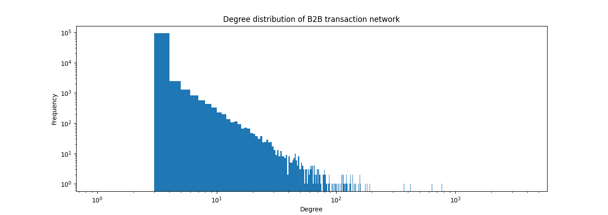

## Multilateral Obligation Dataset

Generating a dataset that simulates a realistic network of B2B transactions.

#### Conditions

- power-law distribution of node degrees and amounts
  - alpha = 2.5
  - x_min = 3
- getting the low degree and extremely high degree nodes right

#### run

```bash
pip install -r requirements.txt
python generate.py
python read_graph.py
```

#### outoput example

b2b_transactions.csv

```csv
source,target,amount
0,9603,708
0,3421,4415
0,5721,1955
0,4041,8204
0,3825,5533
0,10267,2753
0,1054,7746
0,5113,9627
...
```

Network


Power-law distribution


